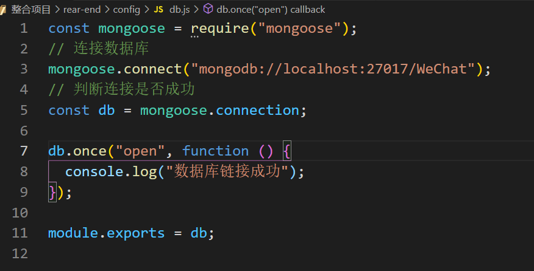
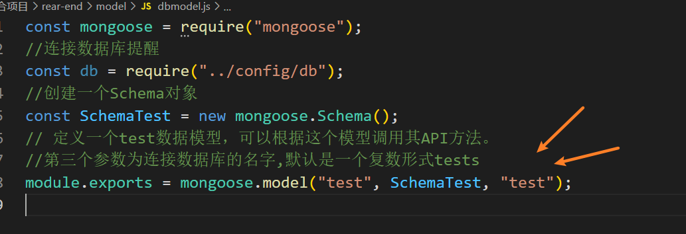
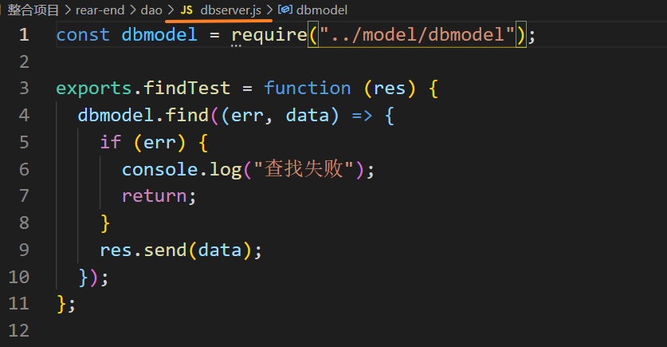
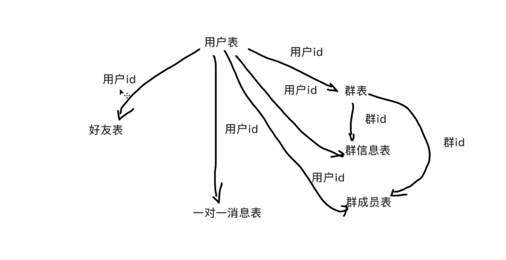
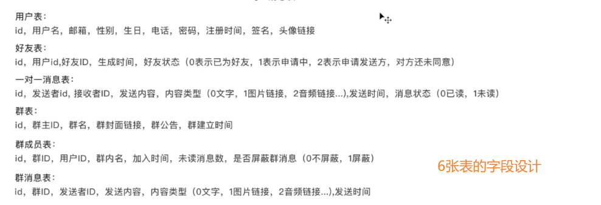
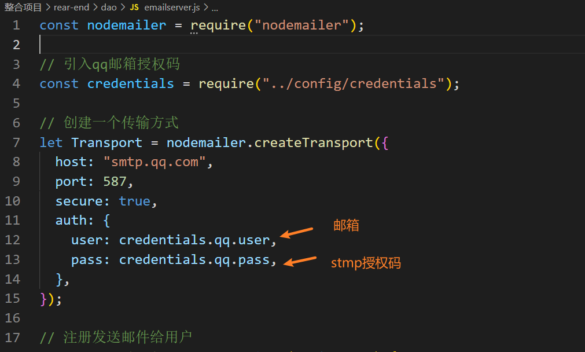
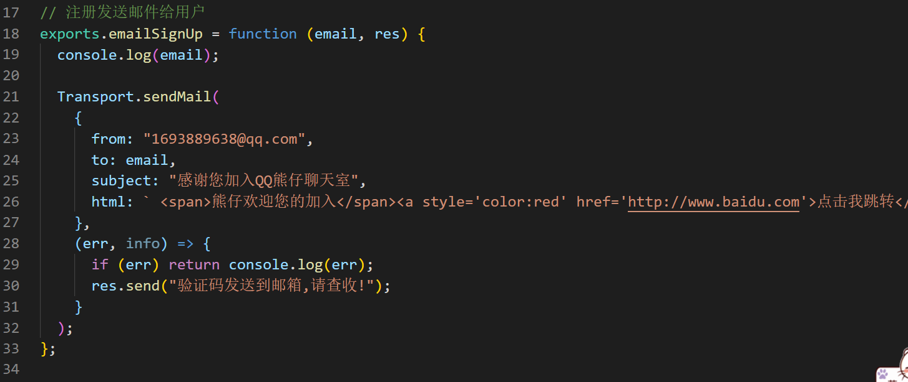
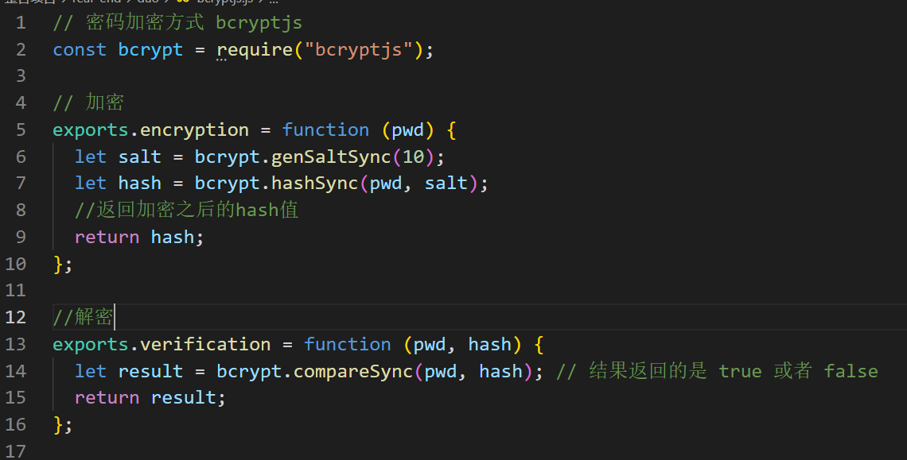
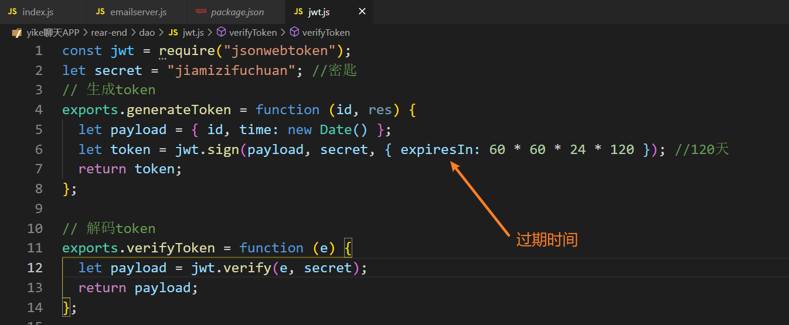

# 项目知识记录

整体数据交互流程图 MVC 模型


## 1.跨域

使用cors跨域,第三方包

## 2.连接MongoDB数据库

使用mongoose包


db.js-->db.model.js-->db.server.js







## 3.数据库表的创建





注意在好友表补充一个字段,好友昵称  markname: { type: String }, //好友昵称

## 4.发送邮件

利用 nodemailer 这一个包





注意配置

```javascript
 host: "smtp.qq.com",
 port: 587,
 secure: false,
```

## 5.密码加密

使用这一个 包bcryptjs



## 6.token 

利用包 jsonwebtoken



## 7.搜索接口


